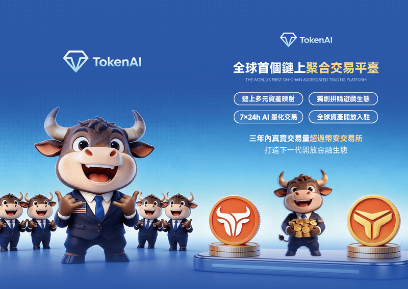
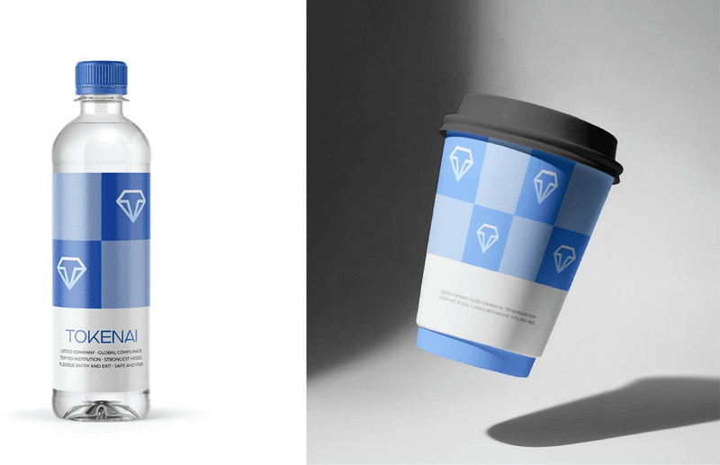

# TokenAi 聚合交易平台

  
  <h1>把交易入口、行情判断与运维响应，收拢到同一个工作台</h1>
  
<strong>面向专业交易场景的一体化聚合交易平台</strong>

  
统一接入多交易渠道，集中完成交易执行、订单追踪、实时行情查看与运维支撑。

  <strong>链接全球资本</strong> · <strong>聚合多渠道交易</strong> · <strong>构建更高效的数字资产协同入口</strong>

---

## 一句话理解 TokenAi

<table>
  <tr>
    <td width="56%">
      
    </td>
    <td width="44%">
      <h3>不是再做一个单点交易工具</h3>
      
TokenAi 更像一个统一工作台，把原本分散在不同渠道、不同页面、不同后台中的关键动作重新组织起来。

      
它连接的是：

      
<strong>行情观察</strong> · <strong>交易执行</strong> · <strong>订单管理</strong> · <strong>异常处理</strong>

      
让用户从“看见机会”到“完成动作”之间，少切换、少等待、少丢信息。

    </td>
  </tr>
</table>

---

## TokenAi 解决什么问题

<table>
  <tr>
    <td width="50%">
      <h3>交易入口分散</h3>
      
多渠道、多页面来回切换，执行动作被频繁打断。

    </td>
    <td width="50%">
      <h3>信息链路割裂</h3>
      
行情、订单、渠道状态与异常信息彼此分散，决策依赖人工拼接。

    </td>
  </tr>
  <tr>
    <td width="50%">
      <h3>交易路径过长</h3>
      
从观察市场到执行下单，再到回查订单，链路过长，响应不够直接。

    </td>
    <td width="50%">
      <h3>运维协同成本高</h3>
      
巡检、告警与排查分散在多个后台，异常处理效率受限。

    </td>
  </tr>
</table>

  

---

## 核心能力

### 聚合接入

统一接入多个交易渠道，构建单一交易入口，降低系统切换成本。

### 交易执行

支持下单、撤单与流程跟踪，让核心交易动作在一个平台内形成闭环。

### 实时行情

集中展示关键行情信息，缩短从市场观察到交易决策之间的路径。

### 订单管理

统一查看订单状态、成交结果与历史记录，提升过程透明度与回溯效率。

### 运维支撑

持续感知渠道状态、服务可用性与异常信息，帮助团队更快发现问题并处理问题。

---

## 为什么它更适合真实业务场景

<table>
  <tr>
    <td width="50%">
      <h3>更少切换</h3>
      
把原本散落在多个标签页和多个后台中的工作，收拢到一个统一入口中。

    </td>
    <td width="50%">
      <h3>更高效率</h3>
      
从观察行情到执行交易，再到订单跟踪与异常处理，整体链路更短。

    </td>
  </tr>
  <tr>
    <td width="50%">
      <h3>更强可控</h3>
      
统一沉淀订单、行情、渠道与运行状态，形成更清晰的全局视图。

    </td>
    <td width="50%">
      <h3>更利于协同</h3>
      
交易用户与运维团队围绕同一个工作台开展工作，减少沟通和判断损耗。

    </td>
  </tr>
</table>

---

## 适用对象

<table>
  <tr>
    <td width="33%">
      <h3>交易用户</h3>
      
需要在统一界面中完成行情观察、下单执行与订单跟踪。

    </td>
    <td width="33%">
      <h3>运维团队</h3>
      
需要持续关注渠道状态、服务稳定性与异常处理效率。

    </td>
    <td width="33%">
      <h3>平台建设团队</h3>
      
希望以标准化方式沉淀交易接入、管理与运维能力。

    </td>
  </tr>
</table>

---

## 品牌识别

品牌不只是一个标志，更是一套完整的识别系统。  
TokenAi 在对外介绍、合作沟通与线下展示中，具备更统一的品牌形象表达。

---

## 品牌应用延展

通过视觉系统与应用物料延展，TokenAi 可以在官网、活动、招商与品牌传播场景中保持一致的识别感。

---

## 信任与资料展示

产品介绍页不仅要表达功能，也需要给合作方足够的信任感。  
这部分适合用于对外沟通、资料发送、项目介绍或品牌背书场景。

> 如用于正式对外材料，建议结合实际合规口径补充对应说明。

---

## 选择 TokenAi

- 用一个入口管理多交易渠道
- 用一套视图看行情、订单与状态
- 用更短路径完成交易执行与回查
- 用更清晰的信息结构提升协同效率
- 用更完整的品牌表达支持对外展示

---

## 官网入口

**官网**: [https://tokenai6.com](https://tokenai6.com)

如果你希望把交易、管理与品牌展示能力统一到一个更完整的产品表达里，TokenAi 是更适合继续打磨和对外呈现的基础版本。
