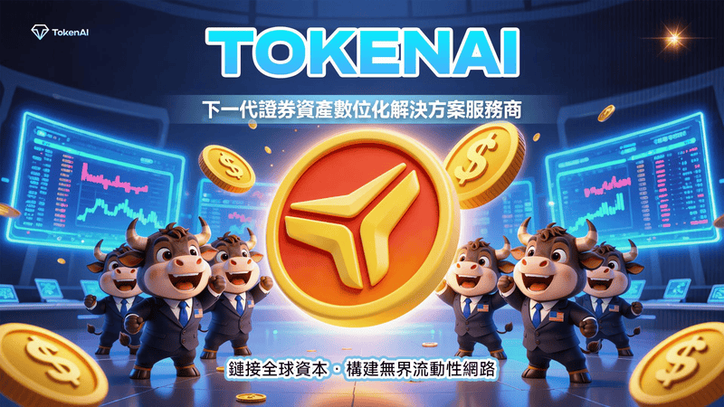
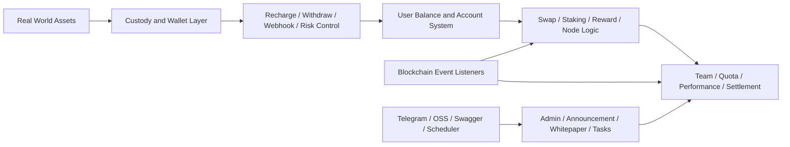

# TokenAi

<div align="center">
  
  <h3>全球首个链上聚合交易平台</h3>
  <p>连接真实资产、链上映射、聚合交易与全球流动性网络的统一后端基础设施</p>
</div>

<p align="center">
  <a href="./README.md">English</a> ·
  <a href="./PRODUCT_INTRO.md">产品介绍</a>
</p>

<p align="center">
  
  
  
  
  
</p>



<div align="center">
  <strong>链接全球资本</strong> · <strong>聚合多渠道交易</strong> · <strong>构建更高效的数字资产协同入口</strong>
</div>

## 项目定位

TokenAi 是一套围绕 `真实资产数字化`、`链上映射`、`聚合交易`、`资产托管` 与 `运营结算` 构建的后端系统。

从当前项目形态能看出来，它不是单纯的展示站，也不是只提供某一个交易接口，而是把下列几类能力组合在一起：

- 面向资产流通的账户与余额体系
- 面向托管场景的充值、提现、风控、Webhook 回调
- 面向链上场景的合约监听、事件同步、交易发送
- 面向平台增长的奖励、团队、节点、配额与收益结算
- 面向业务运营的公告、白皮书、联系信息、任务调度与后台能力

---

## 一句话理解 TokenAi

<table>
  <tr>
    <td width="56%">
      
    </td>
    <td width="44%">
      <h3>不是再做一个单点交易工具</h3>
      <p>TokenAi 更像一个统一工作台，把原本分散在不同渠道、不同页面、不同后台中的关键动作重新组织起来。</p>
      <p>它连接的是：</p>
      <p><strong>资产映射</strong> · <strong>交易执行</strong> · <strong>订单管理</strong> · <strong>托管结算</strong> · <strong>运营协同</strong></p>
      <p>让平台从“资产进入系统”到“交易流通与收益结算”之间，少切换、少断层、少重复处理。</p>
    </td>
  </tr>
</table>

---

## TokenAi 解决什么问题

<table>
  <tr>
    <td width="50%">
      <h3>资产与市场长期割裂</h3>
      <p>真实资产进入链上市场时，常常缺少稳定的映射、托管与交易协同机制。</p>
    </td>
    <td width="50%">
      <h3>交易入口分散</h3>
      <p>用户、运营和后台往往需要在多个系统之间来回切换，信息与动作被不断打断。</p>
    </td>
  </tr>
  <tr>
    <td width="50%">
      <h3>流通链路过长</h3>
      <p>从资产映射、资金流转到交易执行与回查，路径过长，响应不够直接。</p>
    </td>
    <td width="50%">
      <h3>托管与运营协同成本高</h3>
      <p>充值、提现、风控、Webhook、奖励与结算往往分散处理，平台运转效率受限。</p>
    </td>
  </tr>
</table>

<div align="center">
  
</div>

---

## 为什么它更适合真实业务场景

<table>
  <tr>
    <td width="50%">
      <h3>更少切换</h3>
      <p>把资产映射、交易流转、托管风控与运营处理收拢到同一套系统结构中。</p>
    </td>
    <td width="50%">
      <h3>更高效率</h3>
      <p>缩短从资产进入平台到交易执行、回查、结算之间的业务链路。</p>
    </td>
  </tr>
  <tr>
    <td width="50%">
      <h3>更强可控</h3>
      <p>统一沉淀账户、余额、奖励、节点、链上事件与风控状态，形成可持续运营视图。</p>
    </td>
    <td width="50%">
      <h3>更利于协同</h3>
      <p>让产品、运营、财务、风控与技术围绕同一平台状态协作，降低沟通和处理损耗。</p>
    </td>
  </tr>
</table>

---

## 当前项目实际包含什么

当前版本的核心是一套 Go 后端服务，入口在 [main.go](/Users/summer/Documents/AI/AIProject/Trading%20Platform/yytoken-src/main.go)。

它已经明确包含：

- HTTP 服务启动
- Swagger UI 接入
- PostgreSQL 数据访问
- Redis 缓存
- Cobo 客户端初始化
- 定时任务调度器
- USDT 同步命令入口
- 链上合约同步回调注册

从代码结构看，TokenAi 更接近一个 `链上资产运营平台后端`，而不是只有撮合交易的单体服务。

---

## 核心能力

### 1. 资产托管与资金流转

`internal/service/cobo` 模块覆盖了这一层的大部分核心逻辑，包括：

- 充值入账
- 提现申请与审核
- 提现风控规则
- 提现白名单
- Webhook 回调处理
- 直转与归集相关能力
- 节点购买、赠送、奖励发放
- 税费、创始人分红、Telegram 统计通知

这说明 TokenAi 的资金流不是“下单即结束”，而是围绕真实运营场景设计了较完整的托管和清结算流程。

### 2. 链上事件监听与同步

[internal/blockchain](/Users/summer/Documents/AI/AIProject/Trading%20Platform/yytoken-src/internal/blockchain) 中已经存在一整套链上监听与容错组件，包括：

- `mint_stake`
- `mint_group`
- `burn`
- `stake`
- `node_dividend_usdt`
- `refund`
- `referral_reward`
- 统一区块扫描
- 交易发送器
- 熔断与重试管理

这意味着平台并不是手工录入链上结果，而是通过事件监听和同步逻辑把链上状态纳入后端业务系统。

### 3. 交易、奖励与节点体系

从服务与实体结构能确认，平台内建了多类增长与收益分配能力：

- `swap`
- `staking_v2`
- `reward`
- `quota`
- `group_match`
- `node`
- `team`
- `user_team_metrics`

这类结构通常意味着平台不仅关注资产流转，还同时维护用户层级、节点权益、收益记录、配额变化与结算结果。

### 4. 平台运营与内容能力

系统中还包含多个偏运营后台的服务模块：

- `announcement`
- `whitepaper`
- `contact`
- `officeapply`
- `meeting`
- `meetingreimbursement`
- `task`
- `perm`

这说明 TokenAi 后端并非只是交易 API，而是把平台运营、内容维护和管理侧能力也纳入了同一套工程体系。

---

## 技术栈

根据 [go.mod](/Users/summer/Documents/AI/AIProject/Trading%20Platform/yytoken-src/go.mod) 与入口初始化逻辑，当前项目可确认的技术基础如下：

- `Go 1.24`
- `GoFrame 2.9.3`
- `PostgreSQL`
- `Redis`
- `JWT`
- `Swagger UI`
- `go-ethereum`
- `Cobo WaaS SDK`
- `AWS S3 / OSS 兼容对象存储能力`

系统初始化顺序定义在 [internal/frame/init.go](/Users/summer/Documents/AI/AIProject/Trading%20Platform/yytoken-src/internal/frame/init.go)：

1. 时区初始化
2. 配置系统初始化
3. 数据库初始化
4. 内存缓存与 Redis 缓存初始化
5. Cobo 客户端初始化
6. 合约同步检查

---

## 配置与运行方式

这份代码使用 GoFrame 的配置体系，配置优先级在 [internal/frame/config/config.go](/Users/summer/Documents/AI/AIProject/Trading%20Platform/yytoken-src/internal/frame/config/config.go) 中定义为：

- 命令行 `-c / --config` 指定配置文件
- `config.local.yaml`
- `config.yaml`

当前项目已经暴露出的关键配置域包括：

- `database`
- `redis`
- `cobo`
- `blockchain`
- `telegram`
- `oss`
- `googleAuth`

根目录还提供了一个基础环境示例文件：[.env.example](/Users/summer/Documents/AI/AIProject/Trading%20Platform/yytoken-src/.env.example)

可确认的运行入口包括：

- 默认启动 HTTP 服务
- 加载 Swagger UI
- 注册 C 端与 Admin 端路由
- 支持任务命令
- 支持 USDT 同步命令

---

## 代码结构

```text
yytoken-src/
├── main.go
├── go.mod
├── .env.example
├── internal/
│   ├── blockchain/      # 链上监听、扫描、发送、容错
│   ├── dao/             # 数据访问层
│   ├── entity/          # 数据实体
│   ├── frame/           # 配置、DB、缓存、Swagger、基础框架
│   ├── repository/      # 仓储层
│   └── service/         # 业务服务层
└── pkg/
    ├── external/cobo/   # Cobo 外部接入
    ├── httpclient/      # HTTP 客户端封装
    └── utils/           # 通用工具
```

---

## 系统视角下的产品结构



---

## 适用场景

- `链上资产运营平台`：需要用户、资产、余额、结算一体化后端
- `托管型数字资产业务`：需要充值、提现、风控、Webhook 与钱包集成
- `带收益和团队机制的平台`：需要奖励、节点、配额、层级与业绩统计
- `链上事件驱动系统`：需要将合约事件同步到业务数据库与后台流程

---
