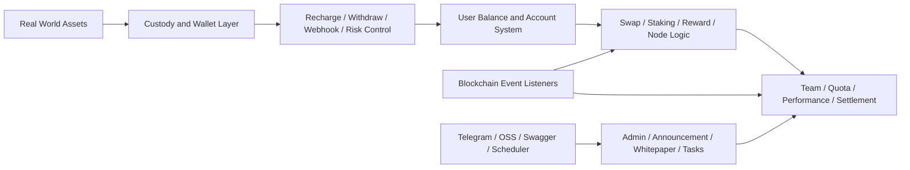

# TokenAI

<div align="center">
  
  <h3>The World's First On-Chain Aggregated Trading Platform</h3>
  <p>A unified backend infrastructure for real-world asset mapping, custody, aggregated trading, and global liquidity coordination</p>
</div>

<div align="center">
  <a href="/Users/summer/Documents/AI/AIProject/Trading Platform/README_TW.md">繁體中文</a> ·
  <a href="/Users/summer/Documents/AI/AIProject/Trading Platform/README_EN.md">English</a> ·
  <a href="/Users/summer/Documents/AI/AIProject/Trading Platform/README_KR.md">한국어</a> ·
  <a href="/Users/summer/Documents/AI/AIProject/Trading Platform/README_JP.md">日本語</a>
</div>

<p align="center">
  
  
  
  
  
</p>


<div align="center">
  <strong>Connect global capital</strong> · <strong>Aggregate multi-channel trading</strong> · <strong>Create a more efficient digital asset coordination layer</strong>
</div>

## Project Positioning

TokenAI is a backend system built around `real-world asset digitization`, `on-chain mapping`, `aggregated trading`, `custody flows`, and `operational settlement`.

From the current project shape, this is clearly more than a landing-page concept. It combines:

- account and balance infrastructure for asset circulation
- custody-oriented recharge, withdrawal, risk control, and webhook flows
- blockchain event listeners, sync services, and transaction senders
- reward, team, node, quota, and performance settlement modules
- admin-side content, whitepaper, contact, task, and operational services

---

## TokenAI in One Sentence

<table>
  <tr>
    <td width="56%">
      
    </td>
    <td width="44%">
      <h3>Not another isolated trading tool</h3>
      <p>TokenAI behaves more like a unified workspace that reorganizes the critical steps previously scattered across different channels, pages, and operational systems.</p>
      <p>It connects:</p>
      <p><strong>asset mapping</strong> · <strong>trade execution</strong> · <strong>order handling</strong> · <strong>custody settlement</strong> · <strong>operations coordination</strong></p>
      <p>That shortens the distance between bringing assets into the platform and turning them into tradable, settled, and operationally manageable flows.</p>
    </td>
  </tr>
</table>

---

## What TokenAI Solves

<table>
  <tr>
    <td width="50%">
      <h3>Assets and markets remain disconnected</h3>
      <p>Real-world assets often lack a stable path across mapping, custody, and coordinated market access.</p>
    </td>
    <td width="50%">
      <h3>Trading entry points are fragmented</h3>
      <p>Users, operators, and admins are forced to move between multiple systems, breaking context and slowing execution.</p>
    </td>
  </tr>
  <tr>
    <td width="50%">
      <h3>Circulation paths are too long</h3>
      <p>From asset onboarding to capital movement, trade execution, and reconciliation, the workflow becomes too stretched.</p>
    </td>
    <td width="50%">
      <h3>Custody and operations coordination is costly</h3>
      <p>Recharge, withdrawal, risk control, webhooks, rewards, and settlements often live in separate process layers.</p>
    </td>
  </tr>
</table>

<div align="center">
  
</div>

---

## Why It Fits Real Business Operations Better

<table>
  <tr>
    <td width="50%">
      <h3>Less switching</h3>
      <p>Asset mapping, trading, custody control, and operations handling are pulled into one system model.</p>
    </td>
    <td width="50%">
      <h3>Higher execution efficiency</h3>
      <p>It shortens the path from onboarding assets to executing, reconciling, and settling platform activity.</p>
    </td>
  </tr>
  <tr>
    <td width="50%">
      <h3>Stronger control</h3>
      <p>Accounts, balances, rewards, nodes, blockchain events, and risk states are unified into one operating view.</p>
    </td>
    <td width="50%">
      <h3>Better cross-team coordination</h3>
      <p>Product, operations, finance, risk, and engineering teams can work against the same platform state.</p>
    </td>
  </tr>
</table>

---

## What the Current Project Contains

The current backend entrypoint lives in [main.go](/Users/summer/Documents/AI/AIProject/Trading%20Platform/yytoken-src/main.go).

The current project already wires together:

- HTTP server startup
- Swagger UI integration
- PostgreSQL access
- Redis caching
- Cobo client initialization
- scheduler startup
- USDT sync command registration
- contract refresh callback registration

Taken together, this looks like a `digital asset operations backend` rather than a thin trading API for TokenAI.

---

## Core Capabilities

### 1. Custody and asset movement

The `internal/service/cobo` domain covers a large share of platform-side fund operations, including:

- recharge processing
- withdrawal request and approval flows
- withdrawal risk control
- withdrawal whitelist management
- webhook processing
- direct transfer and collection-style flows
- node purchase, gifting, and reward distribution
- tax, founder dividend, and Telegram statistics notifications

This indicates TokenAI handles more than order placement. It also models the operational lifecycle of funds and assets.

### 2. Blockchain event sync

The [internal/blockchain](/Users/summer/Documents/AI/AIProject/Trading%20Platform/yytoken-src/internal/blockchain) package already contains listeners, scanners, senders, and fault-tolerance components for:

- `mint_stake`
- `mint_group`
- `burn`
- `stake`
- `node_dividend_usdt`
- `refund`
- `referral_reward`
- unified block scanning
- transaction sending
- retry and circuit-breaker control

That means on-chain state is intended to be synchronized into backend business flows instead of being treated as an external afterthought.

### 3. Rewards, staking, quota, and node systems

The service and entity layout confirms multiple incentive and settlement layers:

- `swap`
- `staking_v2`
- `reward`
- `quota`
- `group_match`
- `node`
- `team`
- `user_team_metrics`

This is typically the shape of a platform that tracks user hierarchy, node rights, quota changes, reward settlement, and performance statistics as first-class business objects.

### 4. Admin and operational content services

The backend also includes operational modules such as:

- `announcement`
- `whitepaper`
- `contact`
- `officeapply`
- `meeting`
- `meetingreimbursement`
- `task`
- `perm`

So the system is not only a trading backend. It also includes platform operations and management-side service layers.

---

## Tech Stack

Based on [go.mod](/Users/summer/Documents/AI/AIProject/Trading%20Platform/yytoken-src/go.mod) and the initialization flow, the current project stack includes:

- `Go 1.24`
- `GoFrame 2.9.3`
- `PostgreSQL`
- `Redis`
- `JWT`
- `Swagger UI`
- `go-ethereum`
- `Cobo WaaS SDK`
- `AWS S3 / OSS-compatible object storage support`

The initialization sequence in [internal/frame/init.go](/Users/summer/Documents/AI/AIProject/Trading%20Platform/yytoken-src/internal/frame/init.go) is explicit:

1. timezone setup
2. config initialization
3. database initialization
4. memory and Redis cache setup
5. Cobo client setup
6. contract sync verification

---

## Configuration and Runtime Model

This project uses GoFrame configuration with the precedence defined in [internal/frame/config/config.go](/Users/summer/Documents/AI/AIProject/Trading%20Platform/yytoken-src/internal/frame/config/config.go):

- command-line `-c / --config`
- `config.local.yaml`
- `config.yaml`

The current project already exposes key configuration domains such as:

- `database`
- `redis`
- `cobo`
- `blockchain`
- `telegram`
- `oss`
- `googleAuth`

A minimal environment example is already present at [.env.example](/Users/summer/Documents/AI/AIProject/Trading%20Platform/yytoken-src/.env.example).

The runtime entrypoint is built to:

- start the default HTTP service
- load Swagger UI
- register C-end and admin routes
- expose scheduler-based tasks
- register USDT sync commands

---

## Repository Structure

```text
yytoken-src/
├── main.go
├── go.mod
├── .env.example
├── internal/
│   ├── blockchain/      # listeners, scanners, senders, fault tolerance
│   ├── dao/             # data access layer
│   ├── entity/          # entities
│   ├── frame/           # config, DB, cache, Swagger, framework boot
│   ├── repository/      # repository layer
│   └── service/         # business services
└── pkg/
    ├── external/cobo/   # Cobo integration
    ├── httpclient/      # HTTP client helpers
    └── utils/           # shared utilities
```

---

## Product Structure from a System View



---

## Where This Backend Fits

- `on-chain asset operation platforms` that need unified user, balance, and settlement logic
- `custody-driven digital asset products` that need recharge, withdraw, webhook, and wallet integration
- `reward and node-based ecosystems` that need quota, hierarchy, and performance accounting
- `event-driven blockchain systems` that need contract events synchronized into business workflows

---
