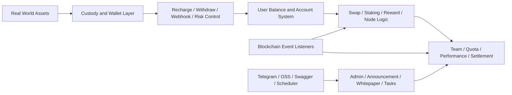

# TokenAI

<div align="center">
  
  <h3>世界初のオンチェーン集約取引プラットフォーム</h3>
  <p>実物資産、オンチェーンマッピング、集約取引、グローバル流動性ネットワークを一体化する統合バックエンド基盤</p>
</div>

<div align="center">
  <a href="/Users/summer/Documents/AI/AIProject/Trading Platform/README_TW.md">繁體中文</a> ·
  <a href="/Users/summer/Documents/AI/AIProject/Trading Platform/README_EN.md">English</a> ·
  <a href="/Users/summer/Documents/AI/AIProject/Trading Platform/README_KR.md">한국어</a> ·
  <a href="/Users/summer/Documents/AI/AIProject/Trading Platform/README_JP.md">日本語</a>
</div>

<p align="center">
  
  
  
  
  
</p>


<div align="center">
  <strong>グローバル資本を接続</strong> · <strong>マルチチャネル取引を集約</strong> · <strong>より効率的なデジタル資産協調レイヤーを構築</strong>
</div>

## プロジェクトの位置づけ

TokenAI は、`実物資産のデジタル化`、`オンチェーンマッピング`、`集約取引`、`資産カストディ`、`運用精算` を中心に構築されたバックエンドシステムです。

現在のプロジェクト構成を見ると、単なる紹介ページでも、単一の取引インターフェースだけを提供するものでもありません。次のような機能が一つのシステムに統合されています。

- 資産流通のためのアカウントおよび残高体系
- カストディ用途の入金、出金、リスク制御、Webhook コールバック
- オンチェーン用途のコントラクト監視、イベント同期、トランザクション送信
- プラットフォーム成長のための報酬、チーム、ノード、クォータ、利益精算
- 運営向けの公告、ホワイトペーパー、連絡先、タスクスケジューリング、管理機能

---

## TokenAI を一言で表すと

<table>
  <tr>
    <td width="56%">
      
    </td>
    <td width="44%">
      <h3>単なる単機能の取引ツールではない</h3>
      <p>TokenAI は、これまで異なるチャネル、ページ、運用システムに分散していた重要な工程を、一つのワークスペースへ再編成する仕組みです。</p>
      <p>接続しているものは次の通りです：</p>
      <p><strong>資産マッピング</strong> · <strong>取引執行</strong> · <strong>注文管理</strong> · <strong>カストディ精算</strong> · <strong>運用連携</strong></p>
      <p>これにより、資産がプラットフォームに取り込まれてから、取引・精算・運用可能なフローになるまでの距離を短縮します。</p>
    </td>
  </tr>
</table>

---

## TokenAI が解決する課題

<table>
  <tr>
    <td width="50%">
      <h3>資産と市場が分断されている</h3>
      <p>実物資産は、マッピング、カストディ、市場接続まで至る安定した経路を欠くことが少なくありません。</p>
    </td>
    <td width="50%">
      <h3>取引の入口が分散している</h3>
      <p>利用者、運用担当者、管理者が複数システムを行き来するため、文脈が途切れ、実行速度が落ちます。</p>
    </td>
  </tr>
  <tr>
    <td width="50%">
      <h3>流通フローが長すぎる</h3>
      <p>資産のオンボーディングから資金移動、取引執行、照合確認までの流れが長くなりすぎます。</p>
    </td>
    <td width="50%">
      <h3>カストディと運用連携のコストが高い</h3>
      <p>入金、出金、リスク制御、Webhook、報酬、精算が別々の処理レイヤーに分散しがちです。</p>
    </td>
  </tr>
</table>

<div align="center">
  
</div>

---

## なぜ実運用により適しているのか

<table>
  <tr>
    <td width="50%">
      <h3>切り替えが少ない</h3>
      <p>資産マッピング、取引、カストディ制御、運用処理を一つのシステムモデルに集約します。</p>
    </td>
    <td width="50%">
      <h3>実行効率が高い</h3>
      <p>資産がプラットフォームに入ってから、実行、照会、精算に至るまでの業務経路を短縮します。</p>
    </td>
  </tr>
  <tr>
    <td width="50%">
      <h3>統制しやすい</h3>
      <p>アカウント、残高、報酬、ノード、オンチェーンイベント、リスク状態を一つの運用ビューに統合します。</p>
    </td>
    <td width="50%">
      <h3>部門横断の連携がしやすい</h3>
      <p>プロダクト、運用、財務、リスク、エンジニアリングが同じプラットフォーム状態を基準に協調できます。</p>
    </td>
  </tr>
</table>

---

## 現在のプロジェクトに含まれているもの

現行バージョンの中核は Go バックエンドサービスであり、エントリーポイントは [main.go](/Users/summer/Documents/AI/AIProject/Trading%20Platform/yytoken-src/main.go) です。

確認できる構成は次の通りです。

- HTTP サーバー起動
- Swagger UI 統合
- PostgreSQL アクセス
- Redis キャッシュ
- Cobo クライアント初期化
- スケジューラー起動
- USDT 同期コマンド登録
- コントラクト更新コールバック登録

全体として見ると、これは単なる取引 API ではなく、`オンチェーン資産運用バックエンド` に近い構成です。

---

## コア機能

### 1. カストディと資産移動

`internal/service/cobo` ドメインは、プラットフォーム上の資金オペレーションの大部分を担っており、次の機能を含みます。

- 入金処理
- 出金申請と承認フロー
- 出金リスク制御
- 出金ホワイトリスト管理
- Webhook 処理
- 直接送金や集約型フロー
- ノード購入、ギフト、報酬配布
- 税務、創業者配当、Telegram 統計通知

つまり TokenAI は単なる注文実行だけでなく、資金と資産の運用ライフサイクル全体を扱います。

### 2. ブロックチェーンイベント同期

[internal/blockchain](/Users/summer/Documents/AI/AIProject/Trading%20Platform/yytoken-src/internal/blockchain) パッケージには、次のためのリスナー、スキャナー、送信機、耐障害コンポーネントがすでに含まれています。

- `mint_stake`
- `mint_group`
- `burn`
- `stake`
- `node_dividend_usdt`
- `refund`
- `referral_reward`
- 統合ブロックスキャン
- トランザクション送信
- リトライおよびサーキットブレーカー制御

これは、オンチェーン状態が外部参照情報ではなく、バックエンド業務フローの中に同期されることを意味します。

### 3. 報酬、ステーキング、クォータ、ノード体系

サービスおよびエンティティ構造から、複数のインセンティブ・精算レイヤーが確認できます。

- `swap`
- `staking_v2`
- `reward`
- `quota`
- `group_match`
- `node`
- `team`
- `user_team_metrics`

このような構造は、ユーザー階層、ノード権利、クォータ変動、報酬精算、業績統計を主要な業務オブジェクトとして追跡するプラットフォームに典型的です。

### 4. 管理および運用コンテンツサービス

バックエンドには次のような運用モジュールも含まれています。

- `announcement`
- `whitepaper`
- `contact`
- `officeapply`
- `meeting`
- `meetingreimbursement`
- `task`
- `perm`

したがって、このシステムは取引バックエンドだけでなく、運用および管理側サービスレイヤーも含んでいます。

---

## 技術スタック

[go.mod](/Users/summer/Documents/AI/AIProject/Trading%20Platform/yytoken-src/go.mod) と初期化フローに基づく、現在のプロジェクトスタックは次の通りです。

- `Go 1.24`
- `GoFrame 2.9.3`
- `PostgreSQL`
- `Redis`
- `JWT`
- `Swagger UI`
- `go-ethereum`
- `Cobo WaaS SDK`
- `AWS S3 / OSS 互換オブジェクトストレージ対応`

[internal/frame/init.go](/Users/summer/Documents/AI/AIProject/Trading%20Platform/yytoken-src/internal/frame/init.go) で定義されている初期化順序は次の通りです。

1. timezone 設定
2. config 初期化
3. database 初期化
4. memory cache と Redis cache の設定
5. Cobo client 設定
6. contract sync 検証

---

## 設定と実行モデル

このプロジェクトは GoFrame の設定体系を使用しており、優先順位は [internal/frame/config/config.go](/Users/summer/Documents/AI/AIProject/Trading%20Platform/yytoken-src/internal/frame/config/config.go) に定義されています。

- コマンドライン `-c / --config`
- `config.local.yaml`
- `config.yaml`

現在のプロジェクトで公開されている主要な設定領域は次の通りです。

- `database`
- `redis`
- `cobo`
- `blockchain`
- `telegram`
- `oss`
- `googleAuth`

最小限の環境サンプルは [.env.example](/Users/summer/Documents/AI/AIProject/Trading%20Platform/yytoken-src/.env.example) にあります。

実行エントリーは次のことを行うように構成されています。

- デフォルト HTTP サービスの起動
- Swagger UI の読み込み
- C 側および Admin 側ルートの登録
- スケジューラーベースのタスク公開
- USDT 同期コマンドの登録

---

## リポジトリ構造

```text
yytoken-src/
├── main.go
├── go.mod
├── .env.example
├── internal/
│   ├── blockchain/      # リスナー、スキャナー、送信機、耐障害
│   ├── dao/             # データアクセス層
│   ├── entity/          # エンティティ
│   ├── frame/           # config、DB、cache、Swagger、フレームワーク起動
│   ├── repository/      # リポジトリ層
│   └── service/         # ビジネスサービス
└── pkg/
    ├── external/cobo/   # Cobo 連携
    ├── httpclient/      # HTTP クライアントヘルパー
    └── utils/           # 共通ユーティリティ
```

---

## システム視点で見た製品構造



---

## 想定ユースケース

- `オンチェーン資産運用プラットフォーム`：ユーザー、資産、残高、精算を統合したバックエンドが必要な場合
- `カストディ型デジタル資産サービス`：入金、出金、リスク制御、Webhook、ウォレット連携が必要な場合
- `報酬とチーム制度を持つプラットフォーム`：報酬、ノード、クォータ、階層、業績統計が必要な場合
- `オンチェーンイベント駆動システム`：コントラクトイベントを業務 DB と運用フローへ同期する必要がある場合

---
