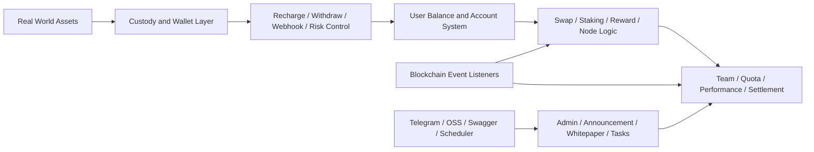

# TokenAI

<div align="center">
  
  <h3>세계 최초의 온체인 집계 거래 플랫폼</h3>
  <p>실물 자산, 온체인 매핑, 집계 거래, 글로벌 유동성 네트워크를 하나로 연결하는 통합 백엔드 인프라</p>
</div>

<div align="center">
  <a href="/Users/summer/Documents/AI/AIProject/Trading Platform/README_TW.md">繁體中文</a> ·
  <a href="/Users/summer/Documents/AI/AIProject/Trading Platform/README_EN.md">English</a> ·
  <a href="/Users/summer/Documents/AI/AIProject/Trading Platform/README_KR.md">한국어</a> ·
  <a href="/Users/summer/Documents/AI/AIProject/Trading Platform/README_JP.md">日本語</a>
</div>

<p align="center">
  
  
  
  
  
</p>


<div align="center">
  <strong>글로벌 자본 연결</strong> · <strong>멀티채널 거래 집계</strong> · <strong>더 효율적인 디지털 자산 협업 레이어 구축</strong>
</div>

## 프로젝트 포지셔닝

TokenAi는 `실물 자산 디지털화`, `온체인 매핑`, `집계 거래`, `자산 커스터디`, `운영 정산`을 중심으로 구축된 백엔드 시스템입니다.

현재 프로젝트 형태를 보면 단순한 소개 페이지도 아니고, 하나의 거래 인터페이스만 제공하는 구조도 아닙니다. 다음과 같은 역량이 한 시스템 안에 결합되어 있습니다.

- 자산 유통을 위한 계정 및 잔액 체계
- 커스터디 시나리오를 위한 입금, 출금, 리스크 제어, Webhook 콜백
- 온체인 시나리오를 위한 컨트랙트 리스닝, 이벤트 동기화, 트랜잭션 전송
- 플랫폼 성장을 위한 보상, 팀, 노드, 쿼터, 수익 정산
- 운영을 위한 공지, 백서, 연락처 정보, 작업 스케줄링, 관리자 기능

---

## TokenAI를 한 문장으로 설명하면

<table>
  <tr>
    <td width="56%">
      
    </td>
    <td width="44%">
      <h3>또 하나의 단일 거래 도구가 아닙니다</h3>
      <p>TokenAI는 서로 다른 채널, 페이지, 운영 시스템에 흩어져 있던 핵심 단계를 하나의 워크스페이스로 다시 조직합니다.</p>
      <p>이 시스템이 연결하는 것은 다음과 같습니다:</p>
      <p><strong>자산 매핑</strong> · <strong>거래 실행</strong> · <strong>주문 관리</strong> · <strong>커스터디 정산</strong> · <strong>운영 협업</strong></p>
      <p>즉, 자산이 플랫폼에 들어온 뒤 거래, 정산, 운영 관리 가능한 흐름으로 전환되기까지의 거리를 줄여 줍니다.</p>
    </td>
  </tr>
</table>

---

## TokenAI가 해결하려는 문제

<table>
  <tr>
    <td width="50%">
      <h3>자산과 시장이 분리되어 있음</h3>
      <p>실물 자산은 매핑, 커스터디, 시장 연결까지 이어지는 안정적인 경로가 부족한 경우가 많습니다.</p>
    </td>
    <td width="50%">
      <h3>거래 진입점이 분산되어 있음</h3>
      <p>사용자, 운영자, 관리자 모두 여러 시스템을 오가야 하므로 문맥이 끊기고 실행 속도가 떨어집니다.</p>
    </td>
  </tr>
  <tr>
    <td width="50%">
      <h3>유통 경로가 너무 길다</h3>
      <p>자산 온보딩부터 자금 이동, 거래 실행, 대사 확인까지의 흐름이 지나치게 길어집니다.</p>
    </td>
    <td width="50%">
      <h3>커스터디와 운영 협업 비용이 크다</h3>
      <p>입금, 출금, 리스크 제어, Webhook, 보상, 정산이 서로 다른 처리 계층에 흩어져 있는 경우가 많습니다.</p>
    </td>
  </tr>
</table>

<div align="center">
  
</div>

---

## 왜 실제 비즈니스 운영에 더 잘 맞는가

<table>
  <tr>
    <td width="50%">
      <h3>전환이 적다</h3>
      <p>자산 매핑, 거래, 커스터디 제어, 운영 처리를 하나의 시스템 모델 안으로 끌어옵니다.</p>
    </td>
    <td width="50%">
      <h3>실행 효율이 높다</h3>
      <p>자산이 플랫폼에 들어온 뒤 실행, 조회, 정산까지 이어지는 업무 경로를 단축합니다.</p>
    </td>
  </tr>
  <tr>
    <td width="50%">
      <h3>통제가 강하다</h3>
      <p>계정, 잔액, 보상, 노드, 온체인 이벤트, 리스크 상태를 하나의 운영 시야로 통합합니다.</p>
    </td>
    <td width="50%">
      <h3>부서 간 협업이 용이하다</h3>
      <p>제품, 운영, 재무, 리스크, 엔지니어링 팀이 같은 플랫폼 상태를 기준으로 협업할 수 있습니다.</p>
    </td>
  </tr>
</table>

---

## 현재 프로젝트에 포함된 내용

현재 버전의 핵심은 Go 백엔드 서비스이며, 진입점은 [main.go](/Users/summer/Documents/AI/AIProject/Trading%20Platform/yytoken-src/main.go) 입니다.

확인 가능한 구성은 다음과 같습니다.

- HTTP 서버 시작
- Swagger UI 통합
- PostgreSQL 접근
- Redis 캐싱
- Cobo 클라이언트 초기화
- 스케줄러 시작
- USDT 동기화 명령 등록
- 컨트랙트 갱신 콜백 등록

전체적으로 보면 이는 단순 거래 API라기보다 `온체인 자산 운영 백엔드`에 가깝습니다.

---

## 핵심 기능

### 1. 커스터디 및 자산 이동

`internal/service/cobo` 영역은 플랫폼 자금 운영의 큰 부분을 담당하며, 다음을 포함합니다.

- 입금 처리
- 출금 신청 및 승인 흐름
- 출금 리스크 제어
- 출금 화이트리스트 관리
- Webhook 처리
- 직접 이체 및 수집형 흐름
- 노드 구매, 선물, 보상 분배
- 세금, 창립자 배당, Telegram 통계 알림

즉, TokenAI는 단순 주문 실행을 넘어서 자금과 자산의 운영 라이프사이클까지 모델링합니다.

### 2. 블록체인 이벤트 동기화

[internal/blockchain](/Users/summer/Documents/AI/AIProject/Trading%20Platform/yytoken-src/internal/blockchain) 패키지에는 다음을 위한 리스너, 스캐너, 전송기, 장애 허용 컴포넌트가 이미 포함되어 있습니다.

- `mint_stake`
- `mint_group`
- `burn`
- `stake`
- `node_dividend_usdt`
- `refund`
- `referral_reward`
- 통합 블록 스캔
- 트랜잭션 전송
- 재시도 및 서킷 브레이커 제어

이는 온체인 상태가 외부 참고용이 아니라 백엔드 비즈니스 흐름 안으로 동기화되도록 설계되었음을 의미합니다.

### 3. 보상, 스테이킹, 쿼터, 노드 체계

서비스 및 엔티티 구조를 보면 여러 인센티브 및 정산 계층이 확인됩니다.

- `swap`
- `staking_v2`
- `reward`
- `quota`
- `group_match`
- `node`
- `team`
- `user_team_metrics`

이런 구조는 사용자 계층, 노드 권리, 쿼터 변경, 보상 정산, 성과 통계를 핵심 비즈니스 객체로 추적하는 플랫폼에서 흔히 보입니다.

### 4. 관리자 및 운영 콘텐츠 서비스

백엔드에는 다음과 같은 운영 모듈도 포함됩니다.

- `announcement`
- `whitepaper`
- `contact`
- `officeapply`
- `meeting`
- `meetingreimbursement`
- `task`
- `perm`

따라서 이 시스템은 거래 백엔드만이 아니라 운영 및 관리 측 서비스 계층까지 포함합니다.

---

## 기술 스택

[go.mod](/Users/summer/Documents/AI/AIProject/Trading%20Platform/yytoken-src/go.mod) 및 초기화 흐름 기준으로 현재 프로젝트 스택은 다음과 같습니다.

- `Go 1.24`
- `GoFrame 2.9.3`
- `PostgreSQL`
- `Redis`
- `JWT`
- `Swagger UI`
- `go-ethereum`
- `Cobo WaaS SDK`
- `AWS S3 / OSS 호환 오브젝트 스토리지 지원`

[internal/frame/init.go](/Users/summer/Documents/AI/AIProject/Trading%20Platform/yytoken-src/internal/frame/init.go) 에 정의된 초기화 순서는 다음과 같습니다.

1. timezone 설정
2. config 초기화
3. database 초기화
4. memory cache 및 Redis cache 설정
5. Cobo client 설정
6. contract sync 검증

---

## 설정 및 실행 모델

이 프로젝트는 GoFrame 설정 체계를 사용하며, 우선순위는 [internal/frame/config/config.go](/Users/summer/Documents/AI/AIProject/Trading%20Platform/yytoken-src/internal/frame/config/config.go) 에 정의되어 있습니다.

- 커맨드라인 `-c / --config`
- `config.local.yaml`
- `config.yaml`

현재 프로젝트에서 노출된 주요 설정 영역은 다음과 같습니다.

- `database`
- `redis`
- `cobo`
- `blockchain`
- `telegram`
- `oss`
- `googleAuth`

기본 환경 예시 파일은 [.env.example](/Users/summer/Documents/AI/AIProject/Trading%20Platform/yytoken-src/.env.example) 에 있습니다.

실행 진입점은 다음을 수행하도록 구성되어 있습니다.

- 기본 HTTP 서비스 시작
- Swagger UI 로드
- C단 및 Admin 라우트 등록
- 스케줄러 기반 작업 노출
- USDT 동기화 명령 등록

---

## 저장소 구조

```text
yytoken-src/
├── main.go
├── go.mod
├── .env.example
├── internal/
│   ├── blockchain/      # 리스너, 스캐너, 전송기, 장애 허용
│   ├── dao/             # 데이터 접근 계층
│   ├── entity/          # 엔티티
│   ├── frame/           # config, DB, cache, Swagger, 프레임워크 부트
│   ├── repository/      # 저장소 계층
│   └── service/         # 비즈니스 서비스
└── pkg/
    ├── external/cobo/   # Cobo 연동
    ├── httpclient/      # HTTP 클라이언트 헬퍼
    └── utils/           # 공용 유틸리티
```

---

## 시스템 관점의 제품 구조



---

## 적용 시나리오

- `온체인 자산 운영 플랫폼` : 사용자, 자산, 잔액, 정산을 통합한 백엔드가 필요한 경우
- `커스터디 기반 디지털 자산 서비스` : 입금, 출금, 리스크 제어, Webhook, 지갑 연동이 필요한 경우
- `보상 및 팀 메커니즘이 있는 플랫폼` : 보상, 노드, 쿼터, 계층, 성과 통계가 필요한 경우
- `온체인 이벤트 기반 시스템` : 컨트랙트 이벤트를 비즈니스 DB와 운영 흐름에 동기화해야 하는 경우

---
