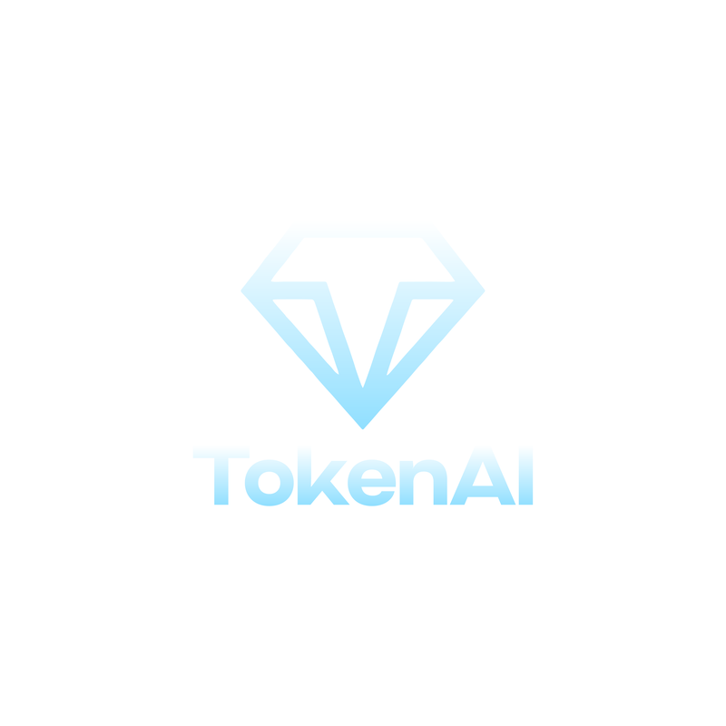
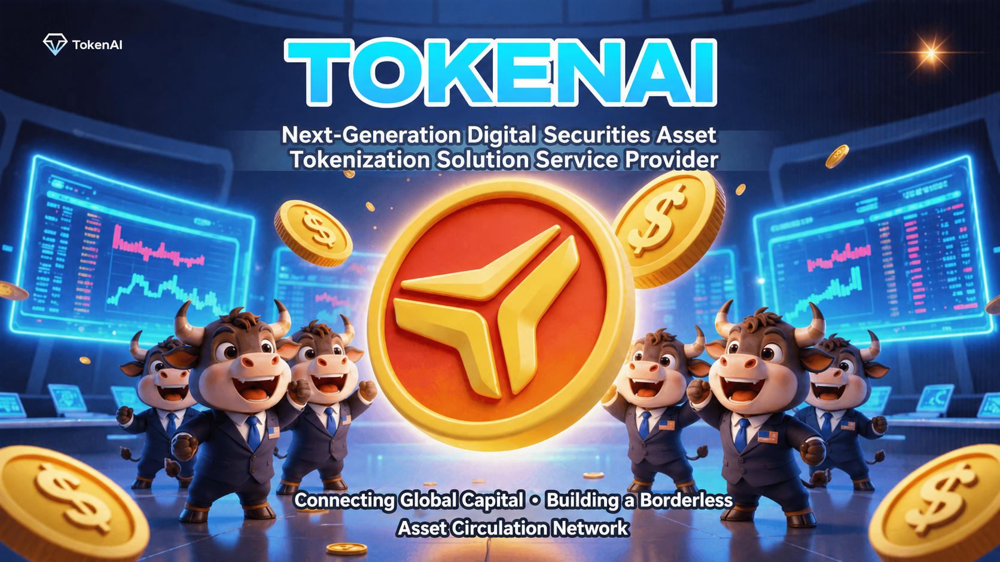
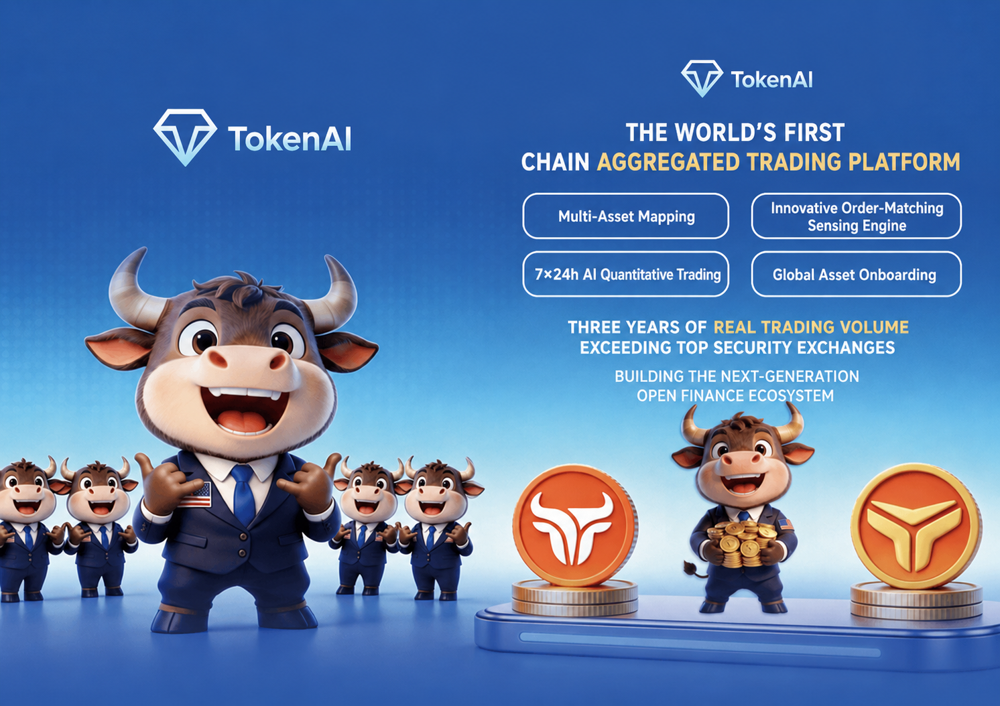
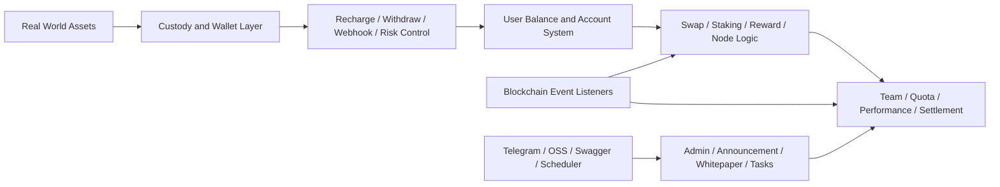

# TokenAI

<div align="center">
  
  <h3>全球首個鏈上聚合交易平台</h3>
  <p>連接真實資產、鏈上映射、聚合交易與全球流動性網路的統一後端基礎設施</p>
</div>

<div align="center">
  <a href="/Users/summer/Documents/AI/AIProject/Trading Platform/README_TW.md">繁體中文</a> ·
  <a href="/Users/summer/Documents/AI/AIProject/Trading Platform/README_EN.md">English</a> ·
  <a href="/Users/summer/Documents/AI/AIProject/Trading Platform/README_KR.md">한국어</a> ·
  <a href="/Users/summer/Documents/AI/AIProject/Trading Platform/README_JP.md">日本語</a>
</div>

<p align="center">
  
  
  
  
  
</p>



<div align="center">
  <strong>連接全球資本</strong> · <strong>聚合多渠道交易</strong> · <strong>打造更高效的數位資產協同入口</strong>
</div>

## 專案定位

TokenAI 是一套圍繞 `真實資產數位化`、`鏈上映射`、`聚合交易`、`資產託管` 與 `營運結算` 建構的後端系統。

從當前專案形態可以看出，它不是單純的展示站，也不是只提供某一個交易介面，而是把下列幾類能力組合在一起：

- 面向資產流通的帳戶與餘額體系
- 面向託管場景的充值、提現、風控、Webhook 回呼
- 面向鏈上場景的合約監聽、事件同步、交易發送
- 面向平台成長的獎勵、團隊、節點、配額與收益結算
- 面向業務營運的公告、白皮書、聯絡資訊、任務調度與後台能力

---

## 一句話理解 TokenAI

<table>
  <tr>
    <td width="56%">
      
    </td>
    <td width="44%">
      <h3>不是再做一個單點交易工具</h3>
      <p>TokenAI 更像一個統一工作台，把原本分散在不同渠道、不同頁面、不同後台中的關鍵動作重新組織起來。</p>
      <p>它連接的是：</p>
      <p><strong>資產映射</strong> · <strong>交易執行</strong> · <strong>訂單管理</strong> · <strong>託管結算</strong> · <strong>營運協同</strong></p>
      <p>讓平台從「資產進入系統」到「交易流通與收益結算」之間，少切換、少斷層、少重複處理。</p>
    </td>
  </tr>
</table>

---

## TokenAI 解決什麼問題

<table>
  <tr>
    <td width="50%">
      <h3>資產與市場長期割裂</h3>
      <p>真實資產進入鏈上市場時，常常缺少穩定的映射、託管與交易協同機制。</p>
    </td>
    <td width="50%">
      <h3>交易入口分散</h3>
      <p>使用者、營運和後台往往需要在多個系統之間來回切換，資訊與動作不斷被打斷。</p>
    </td>
  </tr>
  <tr>
    <td width="50%">
      <h3>流通鏈路過長</h3>
      <p>從資產映射、資金流轉到交易執行與回查，路徑過長，回應不夠直接。</p>
    </td>
    <td width="50%">
      <h3>託管與營運協同成本高</h3>
      <p>充值、提現、風控、Webhook、獎勵與結算往往分散處理，平台運轉效率受限。</p>
    </td>
  </tr>
</table>

<div align="center">
  
</div>

---

## 為什麼它更適合真實業務場景

<table>
  <tr>
    <td width="50%">
      <h3>更少切換</h3>
      <p>把資產映射、交易流轉、託管風控與營運處理收攏到同一套系統結構中。</p>
    </td>
    <td width="50%">
      <h3>更高效率</h3>
      <p>縮短從資產進入平台到交易執行、回查、結算之間的業務鏈路。</p>
    </td>
  </tr>
  <tr>
    <td width="50%">
      <h3>更強可控</h3>
      <p>統一沉澱帳戶、餘額、獎勵、節點、鏈上事件與風控狀態，形成可持續營運視圖。</p>
    </td>
    <td width="50%">
      <h3>更利於協同</h3>
      <p>讓產品、營運、財務、風控與技術圍繞同一平台狀態協作，降低溝通和處理損耗。</p>
    </td>
  </tr>
</table>

---

## 當前專案實際包含什麼

當前版本的核心是一套 Go 後端服務，入口在 [main.go](/Users/summer/Documents/AI/AIProject/Trading%20Platform/yytoken-src/main.go)。

它已經明確包含：

- HTTP 服務啟動
- Swagger UI 接入
- PostgreSQL 資料存取
- Redis 快取
- Cobo 客戶端初始化
- 定時任務調度器
- USDT 同步命令入口
- 鏈上合約同步回呼註冊

從程式結構看，TokenAI 更接近一個 `鏈上資產營運平台後端`，而不是只有撮合交易的單體服務。

---

## 核心能力

### 1. 資產託管與資金流轉

`internal/service/cobo` 模組覆蓋了這一層的大部分核心邏輯，包括：

- 充值入帳
- 提現申請與審核
- 提現風控規則
- 提現白名單
- Webhook 回呼處理
- 直轉與歸集相關能力
- 節點購買、贈送、獎勵發放
- 稅費、創始人分紅、Telegram 統計通知

這說明 TokenAI 的資金流不是「下單即結束」，而是圍繞真實營運場景設計了較完整的託管和清結算流程。

### 2. 鏈上事件監聽與同步

[internal/blockchain](/Users/summer/Documents/AI/AIProject/Trading%20Platform/yytoken-src/internal/blockchain) 中已經存在一整套鏈上監聽與容錯元件，包括：

- `mint_stake`
- `mint_group`
- `burn`
- `stake`
- `node_dividend_usdt`
- `refund`
- `referral_reward`
- 統一區塊掃描
- 交易發送器
- 熔斷與重試管理

這意味著平台並不是手工錄入鏈上結果，而是透過事件監聽和同步邏輯把鏈上狀態納入後端業務系統。

### 3. 交易、獎勵與節點體系

從服務與實體結構能確認，平台內建了多類成長與收益分配能力：

- `swap`
- `staking_v2`
- `reward`
- `quota`
- `group_match`
- `node`
- `team`
- `user_team_metrics`

這類結構通常意味著平台不僅關注資產流轉，還同時維護使用者層級、節點權益、收益記錄、配額變化與結算結果。

### 4. 平台營運與內容能力

系統中還包含多個偏營運後台的服務模組：

- `announcement`
- `whitepaper`
- `contact`
- `officeapply`
- `meeting`
- `meetingreimbursement`
- `task`
- `perm`

這說明 TokenAI 後端並非只是交易 API，而是把平台營運、內容維護和管理側能力也納入了同一套工程體系。

---

## 技術棧

根據 [go.mod](/Users/summer/Documents/AI/AIProject/Trading%20Platform/yytoken-src/go.mod) 與入口初始化邏輯，當前專案可確認的技術基礎如下：

- `Go 1.24`
- `GoFrame 2.9.3`
- `PostgreSQL`
- `Redis`
- `JWT`
- `Swagger UI`
- `go-ethereum`
- `Cobo WaaS SDK`
- `AWS S3 / OSS 相容物件儲存能力`

系統初始化順序定義在 [internal/frame/init.go](/Users/summer/Documents/AI/AIProject/Trading%20Platform/yytoken-src/internal/frame/init.go)：

1. 時區初始化
2. 設定系統初始化
3. 資料庫初始化
4. 記憶體快取與 Redis 快取初始化
5. Cobo 客戶端初始化
6. 合約同步檢查

---

## 設定與執行方式

這份程式使用 GoFrame 的設定體系，設定優先級在 [internal/frame/config/config.go](/Users/summer/Documents/AI/AIProject/Trading%20Platform/yytoken-src/internal/frame/config/config.go) 中定義為：

- 命令列 `-c / --config` 指定設定檔
- `config.local.yaml`
- `config.yaml`

當前專案已經暴露出的關鍵設定域包括：

- `database`
- `redis`
- `cobo`
- `blockchain`
- `telegram`
- `oss`
- `googleAuth`

根目錄還提供了一個基礎環境示例檔案：[.env.example](/Users/summer/Documents/AI/AIProject/Trading%20Platform/yytoken-src/.env.example)

可確認的執行入口包括：

- 預設啟動 HTTP 服務
- 載入 Swagger UI
- 註冊 C 端與 Admin 端路由
- 支援任務命令
- 支援 USDT 同步命令

---

## 程式結構

```text
yytoken-src/
├── main.go
├── go.mod
├── .env.example
├── internal/
│   ├── blockchain/      # 鏈上監聽、掃描、發送、容錯
│   ├── dao/             # 資料存取層
│   ├── entity/          # 資料實體
│   ├── frame/           # 設定、DB、快取、Swagger、基礎框架
│   ├── repository/      # 倉儲層
│   └── service/         # 業務服務層
└── pkg/
    ├── external/cobo/   # Cobo 外部接入
    ├── httpclient/      # HTTP 客戶端封裝
    └── utils/           # 通用工具
```

---

## 系統視角下的產品結構



---

## 適用場景

- `鏈上資產營運平台`：需要使用者、資產、餘額、結算一體化後端
- `託管型數位資產業務`：需要充值、提現、風控、Webhook 與錢包整合
- `帶收益和團隊機制的平台`：需要獎勵、節點、配額、層級與業績統計
- `鏈上事件驅動系統`：需要將合約事件同步到業務資料庫與後台流程

---
